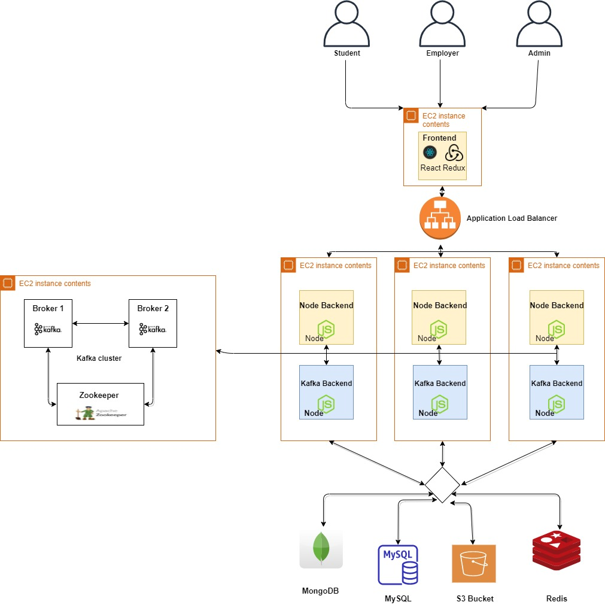
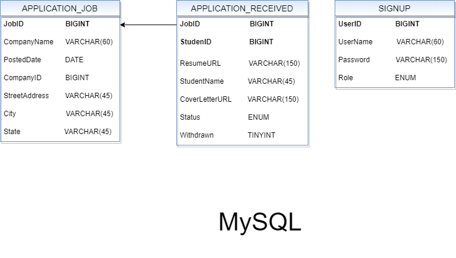
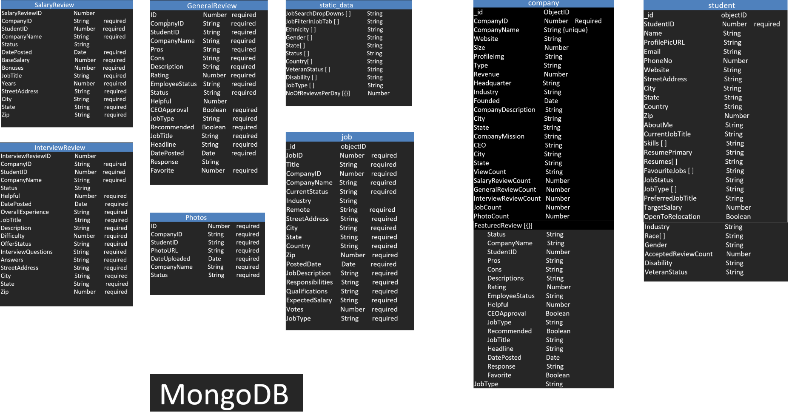

# GlassdoorPrototype
Glass Door Prototype 

This is a simulation of GlassDoor website using the MERN stack covering the below personas

1. Student
* Can search for companies
* Can see and post General Review, Salary Review, Interview Review and Photos for a company
* Apply for a job
* Maintain a profile highligthing current professional status and future opportunities

2. Company
* Can post a job
* Can see the details of applicants and change the status of the applications
* Can see the company statistics related to jobs posted and applicant details

3. Admin
* Can search for company
* Can see the statistics oj reviews, job , most viewed and reviewed company
* Can approve/disapprove the reviews/photos posted before they become publicly visible. 

## Architecture Diagram ##

## Database Schemas ##
### MySQL ###

### MongoDB ###

